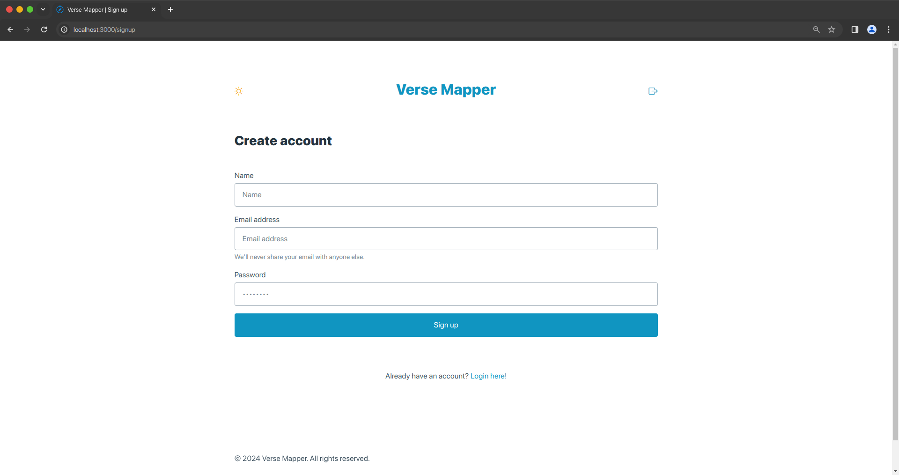
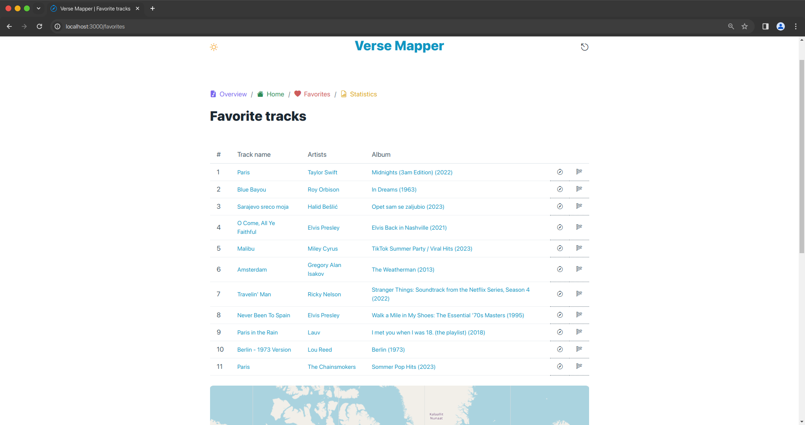

# Verse Mapper Web UI

<table>
  <tr>
    <th>Overview</th>
    <td></td>
    <td></td>
  </tr>
  <tr>
    <td>Registration</td>
    <td colspan=2></td>
  </tr>
  <tr>
    <td>Login</td>
    <td colspan=2></td>
  </tr>
  <tr>
    <td>Searching tracks</td>
    <td colspan=2></td>
  </tr>
  <tr>
    <td>Track details</td>
    <td colspan=2></td>
  </tr>
  <tr>
    <th>Favorites</th>
    <td></td>
    <td></td>
  </tr>
  <tr>
    <th>Statistics</th>
    <td></td>
    <td></td>
  </tr>
</table>